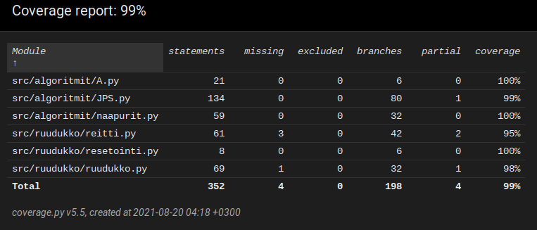

# Testausdokumentti
## Testikattavuusreportti

## Testien toteutus
- Algoritmien testeihin kuuluu kahden käsintehdyn ja kahdenkymmenen satunnaisesti generoidun esteettömän ruudukon ratkaiseminen onnistuneesti. Lisäksi JPS:n testeissä ratkaistaan 100 satunnaista ruudukkoa molemmilla algoritmeilla ja varmistetaan, että molemmat algoritmit saavat saman tuloksen reitin pituudeksi jokaiselle sadasta ruudukosta.
- Ruudukon generoimista ja resetoimista on testattu tutkimalla, että sanakirjoista löytyy oikeat avaimet oikeilla arvoilla.
- Reitin määrittämistä on tutkittu selvittämällä reitti kahdellekymmenelle satunnaisesti generoidulle ruudukolle, jotka ovat ratkaistu JPS:lla, ja tarkistamalla, että reitti päättyy alkuruutuun.
- Käyttöliittymän, suorituskyky.py:n ja index.py:n toiminnan voi testata yksinkertaisesti käynnistämällä ohjelmat ja katsomalla toimiiko komennot ja piirtyykö/tulostuuko kaikki onnistuneesti.
- Suorituskyky testit ovat jaettu kahteen funktioon, joissa toisessa testataan suorituskykyä esteettömissä ruudukoissa ja toisessa esteellisissä ruudukoissa. Molemmissa generoidaan 20 ruudukkoa, jotka ratkaistaan ensin A*:lla, resetoidaan, ja sitten ratkaistaan JPS:lla. Ajat otetaan talteen muuttujiin ja tulostetaan lopuksi.
## Annetut syötteet
Satunnaisesti generoidut ruudukot saavat toiminta testeissä pituudeksi arvotun luvun väliltä 10-100 ja esteiden tiheydeksi luvun väliltä 0-5. Suorituskyky testeissä esteettömät ruudukot ovat 200x200 pituisia ja esteelliset 100x100 pituisia este tiheydellä 1. 
## Testien toistettavuus
Komennolla "poetry run invoke test" kaikki ohjelmiston toimintaan liittyvät testit voidaan suorittaa automaattisesti. Komennolla "poetry run invoke coverage-report" näistä testeistä voi ladata kattavuusreportin. Komennolla "poetry run invoke suorituskyky" voi suorittaa suorituskyky testit.
