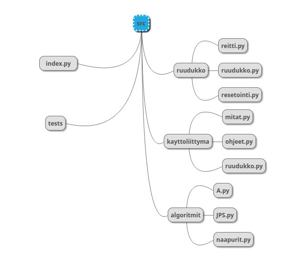

# Toteutusdokumentti
## Ohjelman yleisrakenne

Kaikki koodi on src-hakemistossa jaettuna kolmeen hakemistoon ja tiedostoihin index.py, joka käynnistää ja pyörittää ohjelman, ja suorituskyky.py, joka suorittaa suorituskyky testit. Hakemistoista ruudukko huolehtii ruudukon generoimisesta, resetoinnista ja sille löydetyn reitin muodostamisesta. Hakemisto kayttoliittyma huolehtii pygamen ikkunan piirtämisestä. Tiedostossa mitat.py on tiedot ikkunan ja ruudukon koosta ja käytetyistä fonteista. Hakemisto algoritmit sisältää funktiot A* ja JPS* algoritmeille ja funktion ruudukon ruudun naapureiden löytämiselle ja käsittelemiselle. Lisäksi src hakemistossa on hakemisto tests automaattisia testejä varten.
## Saavutetut aika- ja tilavaativuudet
A* algoritmin aikavaativuus on O(n log n)^1/7 ja JPS algoritmin aikavaativuus on O(n log n)^1/10. (https://www.hindawi.com/journals/ijcgt/2015/736138/tab1/)
Tilavaativuudet ovat molemmilla algoritmeilla kohtuullisen suuret samoin kuin useimmilla reittialgoritmeilla, sillä kaikki ruudut pidetään muistissa. (https://en.wikipedia.org/wiki/A*_search_algorithm#Complexity)
## Suorituskyky vertailu
Tein suorituskyky testini kymmenen kertaa ja otin tulokset ylös. 200x200 pituisten esteettömien ruudukoiden ratkaisemisessa JPS on keskimäärin 15 kertaa nopeampi kuin A* kun taas esteellisten 100x100 ruudukoiden ratkaisemisessa A* on keskimäärin 60 kertaa nopeampi kuin JPS. On oletettavaa, että JPS on huomattavasti nopeampi esteettömissä ruudukoissa, sillä JPS:n idea on estää symmetristen reittien tutkiminen ja siten nopeuttaa toimintaansa ja esteettömissä ruudukoissa on paljon symmetriaa, jota poistaa. Toisaalta paljon esteitä omaavissa ruudukoissa ei usein ole lainkaan symmetriaa, jota poistaa, joten on luonnollista, että JPS ei ole näissä tehokkaampi. On kuitenkin yllättävää, että A* on jopa 60 kertaa nopeampi kuin JPS esteellisissä ruudukoissa. Uskon tämän johtuvan siitä, että esteiden tiheyden vuoksi hyppykohtia luodaan JPS:ssä hyvin paljon ja hyppykohdan käsittelyssä kestää paljon kauemmin kuin A*:lla kestää tutkia ruutu, sillä A*:ssa tutkitaan vain 8 naapuria, kun taas hyppykohdissa tutkitaan kaikki ruudut tiettyyn viistoon suuntaan, kunnes törmätään läpipääsemättömään ruutuun, ja lisäksi jokaisesta näistä ruuduista tutkitaan kaikki ruudut tiettyyn horisontaaliseen sekä vertikaaliseen suuntaan. Esteettömissä ruudukoissa tämä ei ole ongelma, sillä loppuruutu löydetään ensimmäisellä hyppykohdalla, mutta esteellisissä ruudukoissa käydään läpi monia hyppykohtia, jotka löytävät vain lisää ja lisää hyppykohtia, ennenkuin lopulta saavutaan loppuruutuun.
## Puutteet ja parannusehdotukset
Käyttöliittymää voi vielä parannella esimerkiksi mahdollistamalla ruudukoiden muokkaamisen. On myös mahdollista, että algoritmeja voi vielä optimoida.
## Lähteet
- https://www.hindawi.com/journals/ijcgt/2015/736138/tab1/
- https://en.wikipedia.org/wiki/A*_search_algorithm#Complexity
