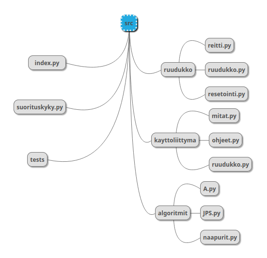

# Toteutusdokumentti
## Ohjelman yleisrakenne

Kaikki koodi on src-hakemistossa jaettuna kolmeen hakemistoon ja tiedostoon index.py, joka käynnistää ja pyörittää ohjelman. Hakemistoista ruudukko huolehtii ruudukon generoimisesta, resetoinnista ja sille löydetyn reitin muodostamisesta. Hakemisto kayttoliittyma huolehtii pygamen ikkunan piirtämisestä. Tiedostossa mitat.py on tiedot ikkunan ja ruudukon koosta ja käytetyistä fonteista. Hakemisto algoritmit sisältää funktiot A* ja JPS* algoritmeille ja funktion ruudukon ruudun naapureiden löytämiselle ja käsittelemiselle. Lisäksi src hakemistossa on hakemisto tests automaattisia testejä varten.
## Saavutetut aika- ja tilavaativuudet
A* algoritmin aikavaativuus on O(n log n)^1/7 ja JPS algoritmin aikavaativuus on O(n log n)^1/10. (https://www.hindawi.com/journals/ijcgt/2015/736138/tab1/)
Tilavaativuudet ovat molemmilla algoritmeilla samat kuin melkein kaikilla reittialgoritmeilla, sillä kaikki ruudut pidetään muistissa. (https://en.wikipedia.org/wiki/A*_search_algorithm#Complexity)
## Suorituskyky vertailu
Aion tehdä funktion, joka generoi ja ratkaisee erilaisia ruudukoita käyttäen molempien algoritmia ja vertaa niiden tehokkuutta. Esimerkiksi laitan molemmat algoritmit selvittämään 500 x 500 ruudukon ilman esteitä 10 kertaa ja vertaan suoritusaikoja. Toisena testinä voin laittaa algoritmit selvittämään ruudukkoja, joissa on tiheästi esteitä eikä välttämättä mahdollisuutta päästä maaliin. 
## Puutteet ja parannusehdotukset
Käyttöliittymä on vielä puutteellinen. Esimerkiksi reitit eivät aina piirry oikein.
## Lähteet
- https://www.hindawi.com/journals/ijcgt/2015/736138/tab1/
- https://en.wikipedia.org/wiki/A*_search_algorithm#Complexity
